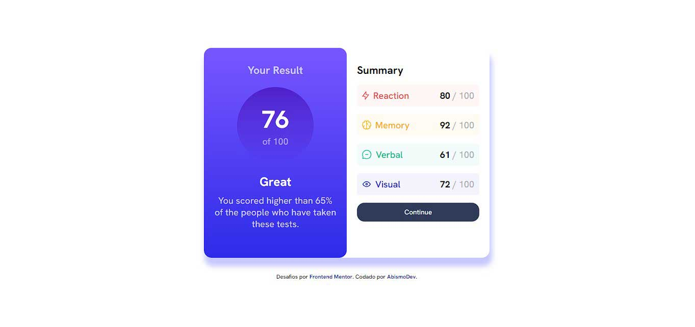

# Frontend Mentor - Results summary component solution

This is a solution to the [Results summary component challenge on Frontend Mentor](https://www.frontendmentor.io/challenges/results-summary-component-CE_K6s0maV). Frontend Mentor challenges help you improve your coding skills by building realistic projects. 

## Table of contents

- [Overview](#overview)
  - [The challenge](#the-challenge)
  - [Screenshot](#screenshot)
  - [Links](#links)
- [My process](#my-process)
  - [Built with](#built-with)
- [Author](#author)

## Overview

### The challenge

Users should be able to:

- View the optimal layout for the interface depending on their device's screen size
- See hover and focus states for all interactive elements on the page
- **Bonus**: Use the local JSON data to dynamically populate the content 
[This project with JSON data here](bronken)

### Screenshot

### Links

- Solution URL: [Solution in Frontend Mentor](https://www.frontendmentor.io/solutions/summary-component-responsive-nXT05WfmKX)
- Live Site URL: [Live Site](https://summary-component-abismodev.vercel.app/)

## My process

### Built with

- Semantic HTML5 markup
- Styled with CSS3
- Flexbox

## Author

- Website - In Construction
- Frontend Mentor - [@AbismoDev](https://www.frontendmentor.io/profile/AbismoDev)
- Instagram - [@Welli.18](https://www.instagram.com/Welli.18)